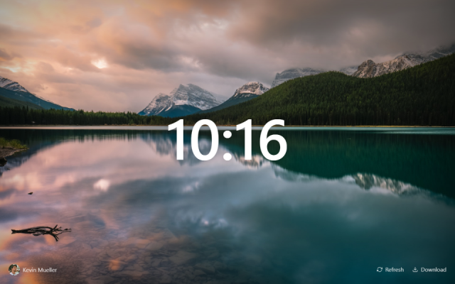

# Daily Splash

Daily Splash is an attempt to recreate products such as [Momentum](https://momentumdash.com/) and [Unsplash Instant](https://instant.unsplash.com/) using a modern React-based toolset. It is a non-commercial project that uses the official [Unsplash API](https://unsplash.com/developers).

It is available to download as a [Chrome extension](https://chrome.google.com/webstore/detail/daily-splash/mhllelegiafiipppnijnbombjinhceho). If you are curious how it works, you can also set it up locally (`yarn && yarn start`), but you will need to [set up your own Unsplash app](https://unsplash.com/documentation#creating-a-developer-account) and set your client ID in the `.env` file.

## Technologies

- [React](https://reactjs.org/) (+ [Hooks](https://reactjs.org/docs/hooks-intro.html))
- [styled-components](https://www.styled-components.com/)
- [react-feather](https://github.com/carmelopullara/react-feather)
